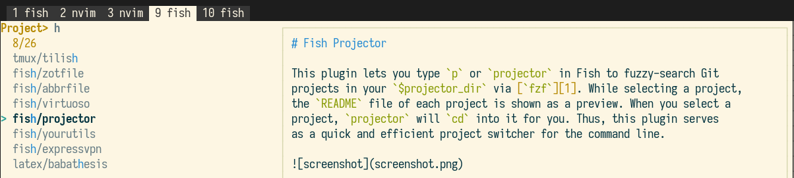

# Fish Projector

This plugin lets you fuzzy-search Git projects in a `$projector_dir` via
[`fzf`][1]. While selecting a project, the `README` of each project is shown as
a preview. When you select a project, `projector` will `cd` into it for you.
Thus, this plugin serves as a quick project switcher for the command line.

If the optional dependency [`bat`][2] is installed, `README.md` and `README.org`
files are shown with syntax highlighting. If [`fd`][3] is installed, it is used
as a replacement for `find` to scan your project directory. Earlier versions
of this plugin also handled Python virtual environments, but I have since
switched to [`direnv`][4], and removed this redundant functionality.

To install the plugin via [`fisher`](https://github.com/jorgebucaran/fisher):

    fisher add jabirali/fish-projector

Please make sure that the dependency `fzf` is installed, and optionally also
`bat` and `fd`. Then set the variable `$projector_dir` to the path where you
store your code projects in `config.fish`, and try typing `projector`.

For extra speed, consider adding `bind \cp projector` or `abbr -ga p projector`
to your `~/.config.fish`; the former lets you launch projector with the keyboard
shortcut <kbd>Ctrl</kbd><kbd>p</kbd>, the latter lets you do so by typing `p`.

[1]: https://github.com/junegunn/fzf
[2]: https://github.com/sharkdp/bat
[3]: https://github.com/sharkdp/fd
[4]: https://github.com/direnv/direnv
